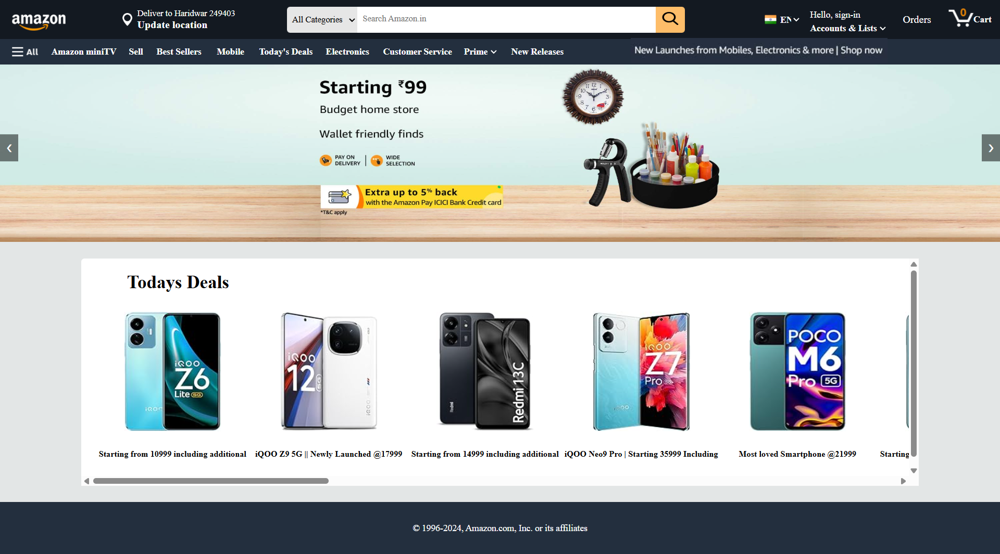

# Amazon Clone

A front-end clone of Amazon's homepage, built as my first web development project. This project showcases basic HTML, CSS, and JavaScript skills learned at the beginning of my web development journey.

Project Deployment Link: https://amazon-clone-liard-seven.vercel.app/

## 📋 Project Overview

This is a static website that replicates the look and feel of Amazon's homepage, featuring:
- Header with logo, location selector, search bar, and navigation links
- Category dropdown menu with multiple product categories
- Responsive navigation bar with popular sections
- Image slider showcasing promotional banners
- Clean and organized CSS styling

## 🚀 Features

- **Header Section**: Complete navigation bar with Amazon logo, delivery location, search functionality, and user account options
- **Category Search**: Dropdown menu with 30+ product categories
- **Navigation Bar**: Quick access links to popular sections (miniTV, Sell, Best Sellers, Today's Deals, etc.)
- **Image Slider**: JavaScript-powered slider for promotional banners with next/previous controls
- **Responsive Design**: Layout adapts to different screen sizes

## 🛠️ Technologies Used

- **HTML5**: Markup structure
- **CSS3**: Styling and layout
- **JavaScript**: Interactive slider functionality

## 📂 Project Structure

```
Amazon-Clone/
├── index.html          # Main HTML file
├── css/
│   ├── style.css       # Main stylesheet
│   └── utils.css       # Utility CSS classes
├── java/
│   └── scriprt.js      # JavaScript for slider functionality
├── img/
│   ├── slider/         # Slider banner images
│   ├── card-slider/    # Product card images
│   └── *.png           # Icons and logos
├── README.md           # Project documentation
├── .gitignore          # Git ignore file
├── .env.example        # Environment variables template
└── package.json        # Project metadata
```

## 🎯 Getting Started

### Prerequisites

- A modern web browser (Chrome, Firefox, Safari, Edge)
- A code editor (VS Code, Sublime Text, etc.)

### Installation

1. Clone the repository:
```bash
git clone https://github.com/lovemishra28/Amazon-Clone.git
```

2. Navigate to the project directory:
```bash
cd Amazon-Clone
```

3. Open `index.html` in your browser:
```bash
# On Windows
start index.html

# On macOS
open index.html

# On Linux
xdg-open index.html
```

Or simply double-click the `index.html` file.

## 💡 What I Learned

This project helped me understand:
- Basic HTML structure and semantic elements
- CSS styling, flexbox layout, and positioning
- JavaScript DOM manipulation and event listeners
- Creating interactive UI components (image slider)
- Project organization and file structure
- Version control basics with Git

## 🔮 Future Enhancements

Potential improvements for this project:
- Add product cards section
- Implement footer with links
- Make the search functionality interactive
- Add more pages (product listing, cart, checkout)
- Improve mobile responsiveness
- Add CSS animations and transitions
- Implement dark mode toggle

## 📸 Screenshots

<!-- Add screenshots of your project here -->


## 🤝 Contributing

This is a beginner learning project, but suggestions and feedback are welcome!

1. Fork the project
2. Create your feature branch (`git checkout -b feature/AmazingFeature`)
3. Commit your changes (`git commit -m 'Add some AmazingFeature'`)
4. Push to the branch (`git push origin feature/AmazingFeature`)
5. Open a Pull Request

## 📝 License

This project is created for educational purposes only. Amazon and its logo are trademarks of Amazon.com, Inc. or its affiliates.

## 👤 Author

**Love Mishra**
- GitHub: [@lovemishra28](https://github.com/lovemishra28)

## 🙏 Acknowledgments

- Amazon.com for design inspiration
- The web development community for learning resources

---

**Note**: This is a front-end clone created for learning purposes and is not affiliated with Amazon in any way.
